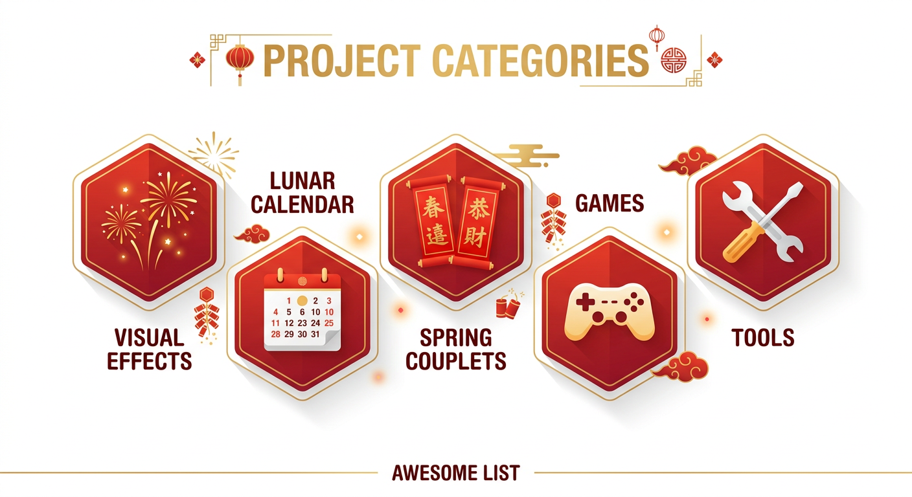

# 🧧 Awesome Spring Festival

> 收录春节主题的趣味技术项目，让传统节日焕发科技光彩

[贡献项目](CONTRIBUTING.md) • [提交项目](../../issues/new?template=project_submission.md) • [讨论](../../discussions)

---

## 🐴 马年 AI 助手 —— 限时在线

> 🌟 **2026 马年春节特别版** — 由本仓库作者打造，免费使用，无需注册

**🔗 立即体验：[spring.rxcloud.group](https://spring.rxcloud.group/)**

| 功能 | 介绍 |
|:---|:---|
| 🎊 **AI 拜年话术** | 8 种关系 × 5 种风格，生成简短/标准/走心三个版本，一键复制 |
| 🛡️ **亲戚防线** | 智能化解 8 类催婚催娃尴尬问题，5 种应对策略，内置快速回复 |
| 🎴 **AI 贺卡生成** | 4 款精美模板（古典红金/现代简约/可爱卡通/水墨书法），一键保存图片 |

**技术栈：** React 18 + TypeScript + Vite + Tailwind CSS + 智谱 GLM-4-Flash + Vercel

📦 **源码：** [cny-ai-web/](./cny-ai-web/)

---

## 📊 项目统计

| 分类 | 数量 |
|:---|:---:|
| 🎆 视觉效果 | 8 |
| 📅 农历日历 | 8 |
| 🧧 春联祝福 | 7 |
| 🎮 游戏娱乐 | 7 |
| 🛠️ 实用工具 | 7 |
| **总计** | **37** |

---

## 🗓️ 按时间线

### 🧹 春节前（准备期）

| 项目 | 描述 | Stars |
|:---|:---|:---:|
| [BluesDawn576/Countdown-Years](https://github.com/BluesDawn576/Countdown-Years) | 春节倒计时，支持阴阳历互转 | - |
| [6tail/lunar-javascript](https://github.com/6tail/lunar-javascript) | JavaScript 农历库 |  |
| [6tail/lunar-typescript](https://github.com/6tail/lunar-typescript) | TypeScript 农历库 |  |
| [vsme/chinese-days](https://github.com/vsme/chinese-days) | 中国节假日查询库 |  |

### 🧨 除夕（团圆夜）

| 项目 | 描述 | Stars |
|:---|:---|:---:|
| [Automattic/canvas-fireworks](https://github.com/Automattic/canvas-fireworks) | WordPress 烟花实验 |  |
| [XXYoLoong/new-year-countdown](https://github.com/XXYoLoong/new-year-countdown) | 新年倒计时 + 烟花效果 | - |
| [bosombaby/Chinese-New-Year-with-fireworks](https://github.com/bosombaby/Chinese-New-Year-with-fireworks) | 带烟花效果的春节计时器 |  |
| [shadcn fireworks](https://www.shadcn.io/background/fireworks) | Canvas 烟花背景效果 | - |

### 🎊 正月（拜年）

| 项目 | 描述 | Stars |
|:---|:---|:---:|
| [YunYouJun/ai-sfc](https://github.com/YunYouJun/ai-sfc) | AI 春联生成器 |  |
| [Soontao/red-packet](https://github.com/Soontao/red-packet) | 微信红包生成系统 |  |
| [liou666/couplet](https://github.com/liou666/couplet) | 桌面春联应用 |  |
| [muzihuaner/deng](https://github.com/muzihuaner/deng) | 网页春节灯笼装饰 |  |

### 🏮 元宵（尾声）

| 项目 | 描述 | Stars |
|:---|:---|:---:|
| [H0nGzA1/NewYearCountDown](https://github.com/H0nGzA1/NewYearCountDown) | Three.js 新年倒计时 | - |

---

## 📂 按分类

### 🎆 视觉效果

烟花、灯笼、粒子特效等视觉效果项目

| 项目 | 描述 | 技术 | Stars |
|:---|:---|:---|:---:|
| [crashmax-dev/fireworks-js](https://github.com/crashmax-dev/fireworks-js) | 多框架烟花库 | JS/Vue/React/Svelte |  |
| [NahuelOrselli/react-firework](https://github.com/NahuelOrselli/react-firework) | React 烟花组件 | Canvas |  |
| [partycles](https://jonathanleane.github.io/partycles/) | React 粒子动画库 | React | - |
| [Automattic/canvas-fireworks](https://github.com/Automattic/canvas-fireworks) | WordPress 烟花实验 | Canvas |  |
| [shadcn fireworks](https://www.shadcn.io/background/fireworks) | Canvas 烟花背景 | Canvas | - |
| [muzihuaner/deng](https://github.com/muzihuaner/deng) | 网页春节灯笼 | HTML/CSS |  |
| [XXYoLoong/new-year-countdown](https://github.com/XXYoLoong/new-year-countdown) | 新年倒计时 + 烟花 | HTML/CSS/JS | - |
| [H0nGzA1/NewYearCountDown](https://github.com/H0nGzA1/NewYearCountDown) | Three.js 倒计时 | Three.js | - |

### 📅 农历日历

农历转换、节假日计算、倒计时等工具

| 项目 | 描述 | 技术 | Stars |
|:---|:---|:---|:---:|
| [6tail/lunar-javascript](https://github.com/6tail/lunar-javascript) | 高精度农历库 | JavaScript |  |
| [6tail/lunar-typescript](https://github.com/6tail/lunar-typescript) | TypeScript 农历库 | TypeScript |  |
| [waterbeside/lunisolar](https://github.com/waterbeside/lunisolar) | 专业农历库 | TypeScript |  |
| [vsme/chinese-days](https://github.com/vsme/chinese-days) | 中国节假日查询 | TypeScript |  |
| [Lofanmi/chinese-calendar-golang](https://github.com/Lofanmi/chinese-calendar-golang) | Go 农历库 | Go |  |
| [bastengao/chinese-holidays](https://github.com/bastengao/chinese-holidays) | Python 节假日数据 | Python |  |
| [kinegratii/borax](https://github.com/kinegratii/borax) | Python 农历工具库 | Python |  |
| [bosombaby/Chinese-New-Year-with-fireworks](https://github.com/bosombaby/Chinese-New-Year-with-fireworks) | 烟花倒计时 | JS/CSS |  |

### 🧧 春联祝福

AI 春联生成、祝福语生成、春联数据等

| 项目 | 描述 | 技术 | Stars | 网站 |
|:---|:---|:---|:---:|:---:|
| [YunYouJun/ai-sfc](https://github.com/YunYouJun/ai-sfc) | AI 春联生成器 | Python/AI |  | [🔗](https://ai-sfc.yunyoujun.cn) |
| [GitHubDaily/AI-Couplet](https://github.com/GitHubDaily/AI-Couplet) | Claude API 春联 | - |  | - |
| [HoshinoSuzumi/ai_couplets](https://github.com/HoshinoSuzumi/ai_couplets) | Vercel 春联生成 | - |  | - |
| [HEUDavid/SpringFestivalCouplets](https://github.com/HEUDavid/SpringFestivalCouplets) | Canvas 春联 | Canvas |  | - |
| [reycn/spring-couplet](https://github.com/reycn/spring-couplet) | 春联数据集 | 数据 |  | - |
| [Asa12138/plot4fun](https://github.com/Asa12138/plot4fun) | R 语言春联可视化 | R/ggplot2 |  | - |
| [liou666/couplet](https://github.com/liou666/couplet) | 桌面春联应用 | Electron |  | - |

### 🎮 游戏娱乐

春节主题游戏、互动应用

| 项目 | 描述 | 技术 | Stars |
|:---|:---|:---|:---:|
| [banghuazhao/Spring-Festival-Crush](https://github.com/banghuazhao/Spring-Festival-Crush) | 春节消消乐 | Swift/SpriteKit |  |
| [shaunanoordin/cny2025](https://github.com/shaunanoordin/cny2025) | 2025 蛇年贺卡 | HTML5 |  |
| [Trae-AI/TRAELand](https://github.com/Trae-AI/TRAELand) | 庙会像素游戏 | 2D/AI |  |
| [heyongsheng/new-year-game](https://github.com/heyongsheng/new-year-game) | 年兽大作战 | Vue |  |
| [inhai-wiki/luckday](https://github.com/inhai-wiki/luckday) | 新年接福 | - |  |
| [potato47/so-many-games](https://github.com/potato47/so-many-games) | 小游戏合集 | Cocos/TS |  |
| [MistEO/involutehell.github.io](https://github.com/MistEO/involutehell.github.io) | 吃掉小鹿乃 | - |  |

### 🛠️ 实用工具

红包系统、节日工具等实用应用

| 项目 | 描述 | 技术 | Stars |
|:---|:---|:---|:---:|
| [Soontao/red-packet](https://github.com/Soontao/red-packet) | 红包系统 | Node.js |  |
| [BytomDAO/BApp-redpacket](https://github.com/BytomDAO/BApp-redpacket) | 区块链红包 | Go |  |
| [coming-chat/go-red-packet](https://github.com/coming-chat/go-red-packet) | 红包合约 | Go |  |
| [DimensionDev/RedPacket](https://github.com/DimensionDev/RedPacket) | Mask DApplet | Web3 |  |
| [kinegratii/borax](https://github.com/kinegratii/borax) | Python 农历工具 | Python |  |
| [mouday/china-calendar](https://github.com/mouday/china-calendar) | 中国日历 | Python |  |
| [liujiawm/php-calendar](https://github.com/liujiawm/php-calendar) | 多时区日历 | PHP |  |

---

## 💝 贡献

欢迎推荐春节主题的优质项目！

### 收录标准

✅ **我们会收录：**
- 春节/新年/元宵相关的开源项目
- 有实际代码仓库（非空项目）
- 最近 2 年有更新或为经典项目
- 项目描述清晰，功能完整

❌ **我们不会收录：**
- 仅含营销链接的项目
- 已失效/删除的项目
- 含违法或不当内容的项目

### 提交方式

1. 通过 [Issue](../../issues/new?template=project_submission.md) 推荐项目
2. 或直接提交 [Pull Request](CONTRIBUTING.md)

详见 [贡献指南](CONTRIBUTING.md)

---

## 🙅 不希望被收录？

如果您是项目作者，不希望项目被收录，请提交 [Issue](../../issues/new)，我们会在 24 小时内移除。

---

## 📜 许可

本项目采用 [CC0 1.0 Universal](LICENSE) 公共领域贡献协议，可自由使用。

收录的项目信息版权归原作者所有。

---

## 🌟 致谢

感谢所有为春节主题开源项目做出贡献的开发者们！

**🧧 新春快乐，马到成功！**

